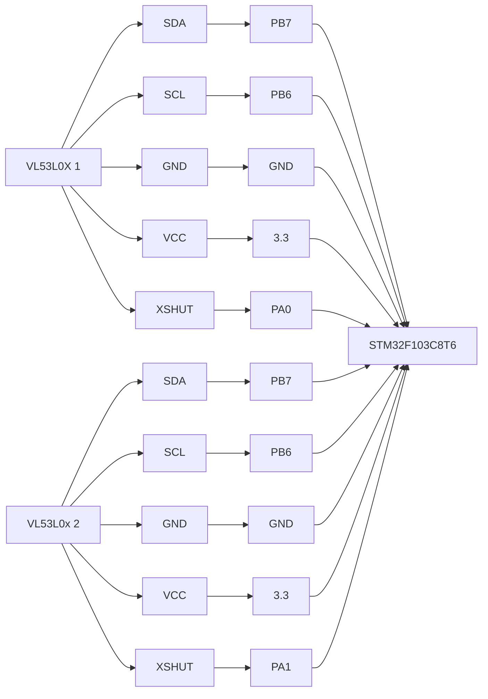

## Connections

```mermaid
   graph LR

  A[VL53L0X 1];
  M[VL53L0x 2];
  B[STM32F103C8T6];
  
  A --> C[SDA];
  A --> D[SCL];
  A --> E[GND];
  A --> F[VCC];
  A --> G[XSHUT];
  
  M --> N[SDA];
  M --> O[SCL];
  M --> P[GND];
  M --> Q[VCC];
  M --> R[XSHUT];
  
  C --> H[PB7];
  D --> I[PB6];
  E --> J[GND];
  F --> K[3.3];
  G --> L[PA0];
  
  N--> S[PB7];
  O--> T[PB6];
  P--> U[GND];
  Q--> V[3.3];
  R--> W[PA1];
  
  H --> B;
  I --> B;
  J --> B;
  K --> B;
  L --> B;
  
  S --> B;
  T --> B;
  U --> B;
  V --> B;
  W --> B;
```
